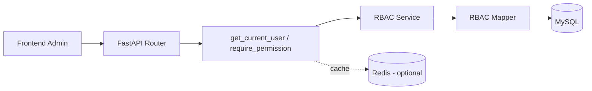

# RBAC 用户权限关联体系设计与实现说明

> 文档版本：v1.0  
> 适用系统：`fastapi_02/backend` 当前实现  
> 技术栈：FastAPI + SQLAlchemy Async + MySQL + JWT  
> 渲染兼容：GitBook / MkDocs（标准 Markdown）

---

## 0. 概览

当前系统已经具备 RBAC 最小可用闭环：

- 用户登录后签发 `JWT access_token + refresh_token`
- 基于 `Depends(get_current_user)` 完成认证
- 基于 `Depends(require_permission("xxx:yyy"))` 完成接口级授权
- 已落地 5 张 RBAC 核心表：`sys_user/sys_role/sys_permission/sys_user_role/sys_role_permission`
- 已有初始化脚本：`backend/sql/rbac_init.sql`

当前属于“接口级 RBAC 第一阶段”，菜单级、数据范围级、审批级能力为后续演进项。

---

## 1. 用户管理模块（User Management）

### 1.1 用户生命周期（Lifecycle）

- 注册：`POST /api/user/register`
- 登录：`POST /api/user/login`
- 刷新令牌：`POST /api/user/refresh`
- 获取当前用户上下文：`GET /api/user/me`
- 软删除策略：依赖 `deleted_at` 字段（当前用户管理接口未开放删除）

### 1.2 核心属性

- 身份属性：`id`（主键）、`username`、`email`
- 安全属性：`hashed_password`、`is_active`
- 审计属性：`created_at`、`updated_at`、`deleted_at`

### 1.3 状态机制

- `is_active=1`：可登录、可鉴权
- `is_active=0`：禁止使用 token 访问（认证阶段直接拒绝）

### 1.4 唯一标识机制

- 业务唯一标识以 `username` 为主
- 现有唯一索引设计：`(username, deleted_at)`（软删除兼容）

> 说明：MySQL 下 `NULL` 在联合唯一中的行为需谨慎，建议后续评估“唯一键 + 删除后重命名”或“`is_deleted` + 联合唯一”方案。

---

## 2. 角色管理模块（Role Management）

### 2.1 角色定义

- 角色实体：`sys_role`
- 关键字段：`name`、`code`、`description`
- 当前默认角色模板：
  - `admin`（超级管理员）
  - `teacher`（教务老师）

### 2.2 角色层级与继承

当前实现未启用显式层级继承；采用“角色集合并集授权”。

- 用户拥有多个角色时，权限为所有角色权限的并集
- `admin` 通过代码短路放行（`require_permission` 内特判）

### 2.3 角色模板策略

通过初始化脚本内置模板角色与初始权限映射，支持幂等导入。

---

## 3. 权限管理模块（Permission Management）

### 3.1 权限粒度

当前已实现：

- API 粒度权限（主干能力）

已预留未完全实现：

- 菜单（menu）
- 按钮（button）
- 数据范围（data scope）
- 列级脱敏（column scope）

### 3.2 权限类型（type）

- 表结构支持：`menu/button/api`
- 当前初始化脚本使用：`api`

### 3.3 唯一编码规范（Permission Code）

推荐统一规范：

- `module:action`
- 示例：`student:read`、`rbac:role:create`、`ai:text2sql`

### 3.4 `parent_id` 用途

- 用于构建权限树（菜单/模块/按钮层级）
- 当前接口级校验尚未消费 `parent_id`
- 后续可用于“父权限展开子权限”或菜单渲染

---

## 4. 用户-角色关联（User-Role Binding）

### 4.1 绑定/解绑流程

- 接口：`POST /api/rbac/users/roles`
- 语义：覆盖式绑定（先删后插）
- 实现位置：`replace_user_roles`

### 4.2 批量操作

- 支持批量传入 `role_ids: list[int]`
- 单次请求完成全量替换

### 4.3 有效期控制

当前未实现“角色有效期（start_at/end_at）”，建议后续在 `sys_user_role` 扩展。

### 4.4 审计日志

当前仅有业务日志（warning/info），未有独立审计表。建议新增 `audit_log` 记录操作者、目标、前后值、时间。

---

## 5. 角色-权限关联（Role-Permission Binding）

### 5.1 授权/回收流程

- 接口：`POST /api/rbac/roles/permissions`
- 语义：覆盖式授权（先删后插）
- 适合权限全量编辑场景

### 5.2 细粒度授权

- 当前粒度：单权限点（`permission_id`）
- 支持任意组合

### 5.3 权限冲突检测

当前无显式冲突模型（Allow/Deny 混用规则）。采用白名单放行模型，不存在“拒绝优先”冲突计算。

### 5.4 灰度发布策略（建议）

- 为权限点增加 `status`（draft/active）
- 通过灰度名单（用户/角色）分批启用
- 与配置中心联动后可热生效

---

## 6. 会话与动态鉴权（Session & Dynamic Authorization）

### 6.1 登录态

- 使用 Bearer Token
- 认证依赖：`get_current_user`

### 6.2 Token 刷新

- 已实现：`POST /api/user/refresh`
- 校验 `token_type=refresh`，返回新 access_token

### 6.3 多设备并发

当前未做设备维度会话管理（未记录设备 ID、未做 token 黑名单）。

### 6.4 权限缓存刷新

当前每次请求实时查询 DB（角色与权限），优点是即时一致，缺点是高并发下压力偏大。  
建议后续引入 Redis 缓存并在角色/权限变更时发布失效事件。

---

## 7. 数据范围权限（Data Scope）

当前状态：未落地。建议按三层推进：

- 行级（Row-Level）：按 `owner_id/class_id/org_id` 追加过滤条件
- 列级（Column-Level）：敏感字段脱敏或隐藏（如手机号、邮箱）
- 组织级（Org-Level）：按组织树节点进行数据隔离

实现建议：

- 在 `require_permission` 之外增加 `require_data_scope(...)`
- 将 scope 注入 service/mapper 查询条件构建器
- 对导出、聚合、Text2SQL 单独加约束

---

## 8. 安全与审计（Security & Audit）

### 8.1 权限变更审计

建议记录：

- 操作者
- 操作对象（user/role/permission）
- 变更前后差异（JSON diff）
- IP / UA / 时间

### 8.2 异常访问告警

- 401/403 高频触发告警
- 权限变更后异常峰值自动告警

### 8.3 合规报表

- 角色-权限矩阵导出
- 用户当前有效权限快照

### 8.4 敏感操作双人复核（Four-Eyes Principle）

建议对高危权限（如 `rbac:role:bind_permission`）引入审批工作流。

---

## 9. 管理后台功能（Admin Console）

建议能力：

- 可视化权限矩阵（User x Permission）
- 批量导入导出（CSV/Excel）
- 权限模拟测试（输入 user_id + endpoint 得出判定）
- 版本快照与回滚（角色模板版本化）

当前前端已具备基础调用能力，但 RBAC 管理专页可进一步增强为独立模块。

---

## 10. RBAC 接口清单（REST/GraphQL）

> 当前仅实现 REST，GraphQL 未启用。

### 10.1 用户认证相关

#### 1) `POST /api/user/register`

- 请求示例：

```json
{
  "username": "alice",
  "password": "123456",
  "email": "alice@example.com"
}
```

- 响应示例：

```json
{
  "code": 200,
  "message": "注册成功",
  "data": null
}
```

#### 2) `POST /api/user/login`

- 请求示例：

```json
{
  "username": "admin",
  "password": "******"
}
```

- 响应示例：

```json
{
  "code": 200,
  "message": "success",
  "data": {
    "access_token": "xxx",
    "refresh_token": "yyy",
    "token_type": "bearer",
    "expires_in": 1800
  }
}
```

#### 3) `POST /api/user/refresh`

- 请求示例：

```json
{
  "refresh_token": "yyy"
}
```

#### 4) `GET /api/user/me`

- Header：`Authorization: Bearer <access_token>`
- 响应示例：

```json
{
  "code": 200,
  "message": "success",
  "data": {
    "id": 2,
    "username": "admin",
    "email": null,
    "roles": ["admin"],
    "permissions": ["rbac:role:read", "student:read"]
  }
}
```

### 10.2 RBAC 管理相关

#### 1) `GET /api/rbac/roles`
- 权限：`rbac:role:read`

#### 2) `POST /api/rbac/roles`
- 权限：`rbac:role:create`

```json
{
  "name": "审计员",
  "code": "auditor",
  "description": "审计只读角色"
}
```

#### 3) `POST /api/rbac/roles/update`
- 权限：`rbac:role:update`

```json
{
  "role_id": 2,
  "name": "教务老师",
  "description": "教学业务操作角色"
}
```

#### 4) `DELETE /api/rbac/roles/{role_id}`
- 权限：`rbac:role:delete`

#### 5) `GET /api/rbac/permissions`
- 权限：`rbac:permission:read`

#### 6) `POST /api/rbac/users/roles`
- 权限：`rbac:user:bind_role`

```json
{
  "user_id": 3,
  "role_ids": [2]
}
```

#### 7) `POST /api/rbac/roles/permissions`
- 权限：`rbac:role:bind_permission`

```json
{
  "role_id": 2,
  "permission_ids": [8, 9, 10]
}
```

#### 8) `GET /api/rbac/users/{user_id}/permissions`
- 权限：已登录（当前未加专属 `rbac:user:permission:read`）

### 10.3 统一错误码（当前约定）

- `200`：成功（业务成功）
- `400`：业务校验失败（通过 `BaseResponse.error` 返回）
- `401`：未认证或 token 无效（`HTTPException`）
- `403`：权限不足（`require_permission`）
- `500`：服务异常

---

## 11. 数据库 ER 与核心表结构

## 11.1 ER 关系（文字版）

- `sys_user` 1..n `sys_user_role` n..1 `sys_role`
- `sys_role` 1..n `sys_role_permission` n..1 `sys_permission`
- `sys_permission.parent_id` 自关联形成权限树（预留）

架构图（PNG）：`backend/docs/assets/rbac_architecture.png`

### 11.2 核心表字段

#### `sys_user`
- 主键：`id`
- 关键字段：`username`、`hashed_password`、`is_active`
- 软删除：`deleted_at`
- 索引：`uk_username_deleted`、`uk_email_deleted`

#### `sys_role`
- 主键：`id`
- 关键字段：`name`、`code`、`description`
- 索引：`uk_code_deleted`、`idx_name`

#### `sys_permission`
- 主键：`id`
- 关键字段：`parent_id`、`name`、`code`、`type`
- 索引：`uk_code_deleted`、`idx_parent_id`

#### `sys_user_role`
- 复合主键：`(user_id, role_id)`
- 辅助索引：`idx_role_id`

#### `sys_role_permission`
- 复合主键：`(role_id, permission_id)`
- 辅助索引：`idx_permission_id`

> 当前关联表无显式外键约束，依赖应用层控制。建议后续评估补充 FK（或保留软约束并加强审计）。

---

## 12. 性能与扩展（Performance & Scalability）

### 12.1 缓存策略

- 当前：实时 DB 查询，强一致
- 建议：Redis 缓存 `user_roles`/`user_permissions`
- 失效策略：角色/权限变更后按用户维度删除缓存

### 12.2 水平扩展

- 读写分离：鉴权读请求可走只读库
- 分库分表：超大规模可按 `tenant_id` 或 `org_id` 水平切分

### 12.3 权限预计算

- 将角色权限展开为用户直连权限快照（如 `sys_user_permission_cache`）
- 降低实时 join 成本

### 12.4 异步刷新

- 变更事件写入消息队列（Kafka/RabbitMQ）
- 后台异步刷新缓存和快照

---

## 13. 测试与验收标准（Testing & Acceptance）

### 13.1 现有测试资产

- 冒烟脚本：
  - `backend/script/rbac_smoke_test.py`
  - `backend/script/rbac_teacher_negative_test.py`

### 13.2 目标标准（建议）

- 单元测试覆盖率：`>= 90%`（RBAC 核心模块）
- 集成测试：认证 + 授权 + 角色/权限绑定 + 回归用例
- 性能基线：`QPS >= 5000`、`P99 <= 100ms`（需缓存和压测支撑）
- 安全测试：JWT 伪造、重放、越权、注入、暴力破解专项报告

### 13.3 现实评估

当前系统已具备功能正确性基础，但尚未达到上述性能与覆盖率目标，需要后续测试工程化投入。

---

## 14. 交付清单（Deliverables）

- Markdown 文档：`backend/docs/rbac_user_permission_system.md`
- PNG 架构图：`backend/docs/assets/rbac_architecture.png`
- SQL 初始化脚本：`backend/sql/rbac_init.sql`

---

## 附录 A：架构图 Mermaid（可选）



## 附录 B：当前实现边界声明

- 当前仅实现 REST，不含 GraphQL。
- 当前权限主能力为 API 级 RBAC。
- 菜单、数据范围、审批流、审计报表为增强项。
